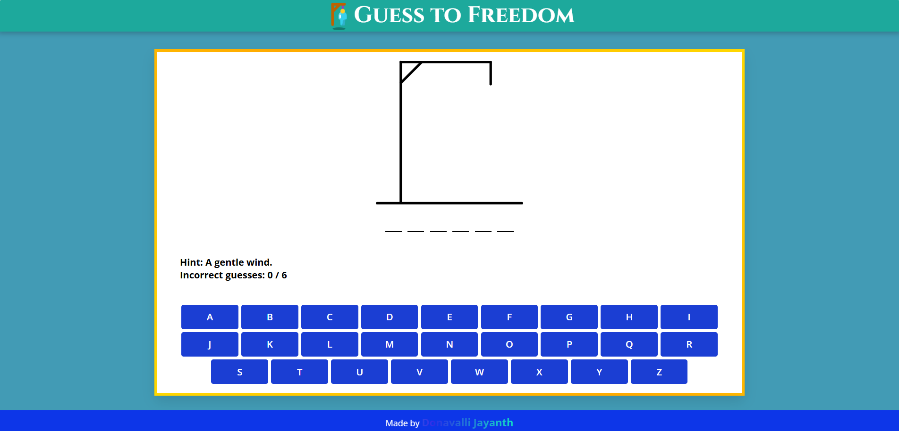

# 🎮 Guess to Freedom - A Hangman Game

## 📝 Description
**"Guess to Freedom"** is an interactive **Hangman-style word game** where players must guess the correct word before running out of attempts. Every time you fail, the game resets with a **new word & hint!** 😱  

Are you ready to **test your vocabulary** and **win your freedom?** 🏆

---

## 🚀 Features
✅ **Fun & Addictive Gameplay** – Guess the hidden word before you run out of chances.  
✅ **Unique Words Every Game** – Never the same challenge twice!  
✅ **📜 Word Hints** – Get a little help when you're stuck.  
✅ **🎨 Smooth UI & Animations** – A visually appealing & responsive interface.  
✅ **🎭 Hangman Image Representation** – Watch the hangman build as you make mistakes.  
✅ **🎮 On-Screen Keyboard** – Clickable letters for easy interaction.  
✅ **📊 Scoreboard & Progress Bar** – Track your attempts visually.  
✅ **🔄 Mobile-Friendly** – Fully responsive across all screen sizes.  
✅ **🔊 Sound Effects** *(Coming Soon!)* – Audio feedback for correct/wrong guesses.  
✅ **🌍 Online Play (No Install Needed)** – Hosted on GitHub Pages & Netlify.  

---

## 🛠 Installation
1. **Clone the Repository**
   ```bash
   git clone https://github.com/Jayanth0124/Hangman-game.git
   cd guess-to-freedom
   ```
2. **Open `index.html` in a browser**
   - No setup required! Just play & enjoy. 🎉

---

## 🎮 How to Play
1. **Click letters** to guess the hidden word.  
2. **Limited attempts** – Choose your letters wisely!  
3. **Win the game** by guessing the full word before attempts run out.  
4. **Click "Play Again"** to start a new game with a fresh word.  

---

## 🌐 Live Demo
🔗 **[Play "Guess to Freedom" Online!](https://lettermind.netlify.app/)**  

---

## 📷 Screenshot


---

## 📜 License
This project is **open-source**. Feel free to **modify, improve, and contribute!** 🚀  

💡 **Enjoy the game & have fun guessing!** 🎯
